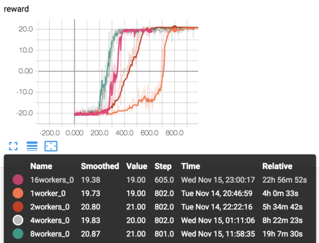
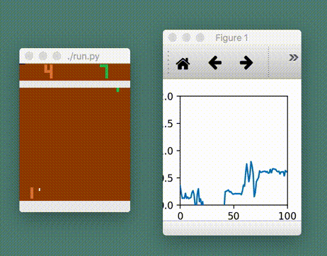
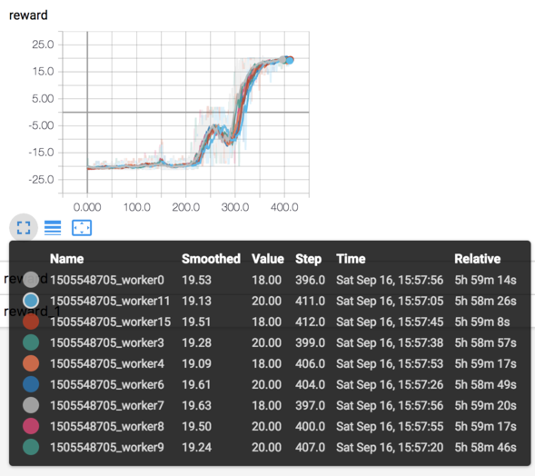
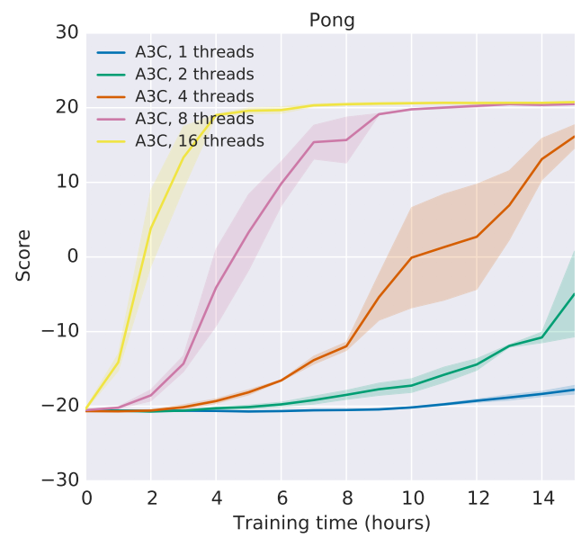

# TensorFlow A3C

Side project doing a TensorFlow implementation of [A3C](https://arxiv.org/abs/1602.01783).

Started as part of a [reproduction](https://github.com/mrahtz/learning-from-human-preferences) of [Deep Reinforcement Learning from Human Preferences](https://arxiv.org/abs/1706.03741), but currently on hold, in favour of OpenAI's A2C implementation instead.

In progress; ugly code.

## Milestones

* 19/07/2017: Implemented A3C training operations
* 28/07/2017: Got Distributed TensorFlow working
* 08/08/2017: Implemented all preprocessing stages
* 18/08/2017: Functioning with a single worker
* 20/08/2017: Functioning with multiple workers

* 23/08/2017: Implemented action entropy bonus
* 30/08/2017: Implemented visualisation of value network output, for a sanity check

## Usage

* `run.py` starts a single worker. One worker should be started with a `worker_n` of 0; this worker holds the graph.
* `run.sh` is a wrapper which starts 16 workers.

## Unsolved questions/todos

* Memory usage is higher than it seems like it should be.
* Currently gradients are accumulated over an entire episode rather than only 5 time steps as in the paper. With 5 time steps, it doesn't work.
* Based on a cursory comparison, OpenAI's A2C implementation seems to run faster.
* Currently Adam is used, whereas the paper uses RMSProp. If RMSProp is used instead of Adam, it doesn't work.
* Shared optimiser statistics currently isn't implemented.
* It doesn't seem to learn as fast as in the paper. With 16 workers, it takes about 6 hours to reach full reward (git c693e72).

* Whereas the paper reaches maximum reward within about 2 hours.

.
