# OCD A3C

[](https://circleci.com/gh/mrahtz/ocd-a3c)

TensorFlow implementation of [asynchronous advantage actor-critic (A3C)](https://arxiv.org/abs/1602.01783) for Atari games using OpenAI
Gym, built with love, kindness - and since deep RL is
[apparently easy to mess up](https://blog.openai.com/openai-baselines-dqn/) - OCD levels of thoroughness and care.


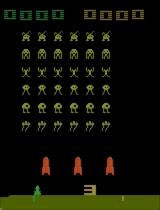
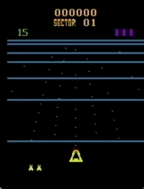


## Results

### Game scores

The main Atari games tested in the paper were Beamrider, Breakout, Pong, Q*bert and Space Invaders.
Reported results on A3C (Figure 4) from the paper were:


OCD A3C achieves comparable results on Pong and Breakout; superior results on Q*bert; but significantly
worse results on Beamrider and Space Invaders:


(Original logs for these runs, commands used to run them, resulting policies, and script
 used to plot results can be found at
[ocd-a3c-runs/master_a19cf29](https://github.com/mrahtz/ocd-a3c-runs/tree/master_a19cf29).)

I'm assuming discrepancies are due to hyperparameter differences: the paper tries 50 different
learning rates/initializations for each game and reports the best three, whereas our results
use the same hyperparameters throughout: learning rate 1e-4 and a gradient clip of 5.0 (with shaded regions
showing best/worst scores over three random seeds).

### Speedup from multiple workers

How close to a linear speedup do we get from adding extra workers?

The most dramatic results from the paper were for Pong:

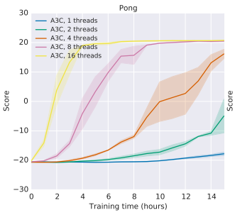

Running on 16 cores, though OCD A3C does match the performance for 16 workers, the speedups
between 1 and 16 workers are not as linear:

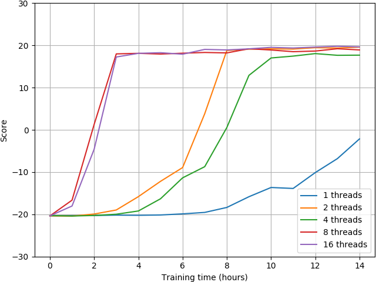

(Data for these runs can be found at
[ocd-a3c-runs/master_60d4b42](https://github.com/mrahtz/ocd-a3c-runs/tree/master_60d4b42).)

However, the speedup _does_ seem to be roughly linear when scores are instead plotted against episode
number:

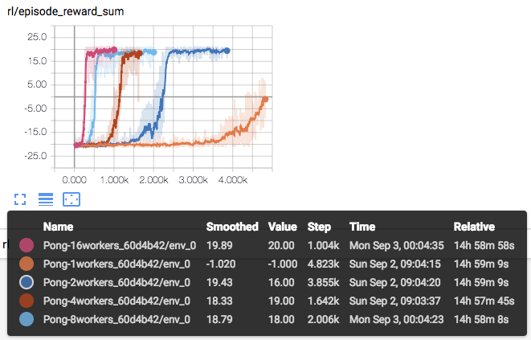

This suggests that OCD A3C functions correctly in terms of accelerating learning by aggregrating
experience from multiple workers, but that there's significant overhead from extra workers due
to e.g. GIL (described below).

## Usage

### Python setup

To set up an isolated environment and install dependencies, install
[Pipenv](https://github.com/pypa/pipenv) (e.g. `pip install --user pipenv`), then just run:

`$ pipenv sync`

However, note that TensorFlow must be installed manually. Either:

`$ pipenv run pip install tensorflow`

or

`$ pipenv run pip install tensorflow-gpu`

depending on whether you have a GPU. (If you run into problems, try TensorFlow 1.10.)

If you want to run tests, also run:

`$ pipenv install --dev`

Finally, before running any of the scripts, enter the environment with:

`$ pipenv shell`

### Running

We support Atari environments using a feedforward policy. Basic usage is:

```
$ python3 train.py --n_workers <no. of workers> <environment name>
```

For example, to train an agent on Pong using 16 workers:

```
$ python3 train.py --n_workers 16 PongNoFrameskip-v4
```

TensorBoard logs and checkpoints will be saved to a new directory in `runs`. To specify the name of
the directory, use `--run_name`.

Run `train.py --help` to see full usage options, including tuneable hyperparameters.

Once training is completed, examine trained behaviour with:

```
$ python3 run_checkpoint.py <environment name> <checkpoint directory>
```

For example, using a checkpoint from [ocd-a3c-runs](https://github.com/mrahtz/ocd-a3c-runs):

```
$ python3 run_checkpoint.py PongNoFrameskip-v4 ocd-a3c-runs/Pong-0_a19cf29/checkpoints/
```

### Tests

Tests can be run individually, e.g.:

```
$ tests/network_test.py
```

Or all together, with:

```
$ python3 -m unittest tests/*_test.py
```


## Special Features

To earn its epithet, OCD A3C includes a few special testing features.

### Randomness checks

An annoying thing with deep RL is when a change which should be inconsequential apparently
breaking things because it inadvertently changes random seeding. To make it more obvious when this
might have happened, [`train_test.py`](tests/train_test.py) does an end-to-end run checking that starting
from a fixed seed, after 100 updates, weights are exactly the same as what they were in previous versions of the code.

### See through the eyes of the agent

Run [`preprocessing_play.py`](tests/preprocessing_play.py) to play the game through the eyes of the agent using Gym's
[`play.py`](https://github.com/openai/gym/blob/a77b139e5875c2ab5c7ad894d0819a4e16c3f27f/gym/utils/play.py).
You'll see the full result of the preprocessing pipeline (including the frame stack, spread out
horizontally over time):

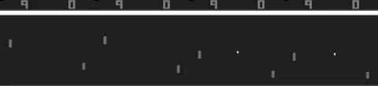

### See what the network sees

Still, what if we fumble something up between the eyes and the brain - between the preprocessing
pipeline and actually sending the frames into the policy network for inference or training?

Using [`tf.Print`](https://www.tensorflow.org/api_docs/python/tf/Print), we can dump all data
going into the network then later check whether things are right. This involves first running
`train.py` with the `--debug` flag and piping `stderr` to a log file:

```
$ python3 train.py PongNoFrameskip-v4 --debug 2> debug.log
```

Then, run `show_debug_data.py` on the resulting log:

```
$ python3 show_debug_data.py debug.log
```

You'll see the first five four-frame stacks used to choose actions on the first five steps in the
environment (with individual frames numbered - starting from 12 here because of the random number of
initial no-ops used to begin each episode - and with two numbers on each frame because of the
[maximum taken over subsequent frames](https://github.com/mrahtz/tensorflow-a3c/blob/b322b6e2686c84f9e00c8e397ea90eba355e9a7a/preprocessing.py#L23)):

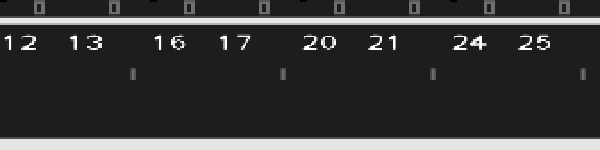
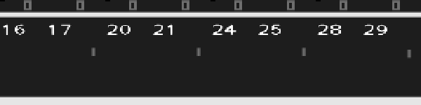
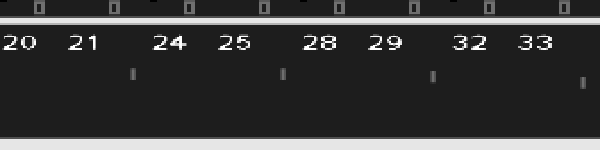
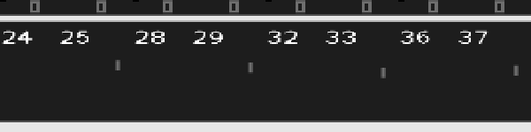
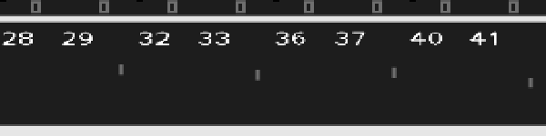

Then the stack from the final state reached being fed into the network for value estimation:


Then a batch of the first five stacks all together, used for for the first training step:

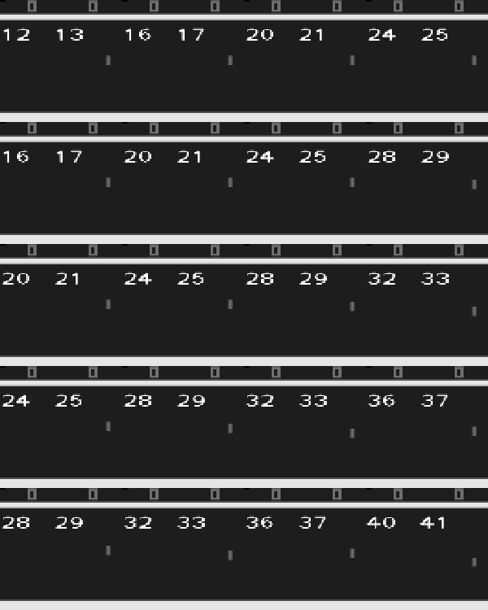

With the corresponding returns and actions for the training batch:


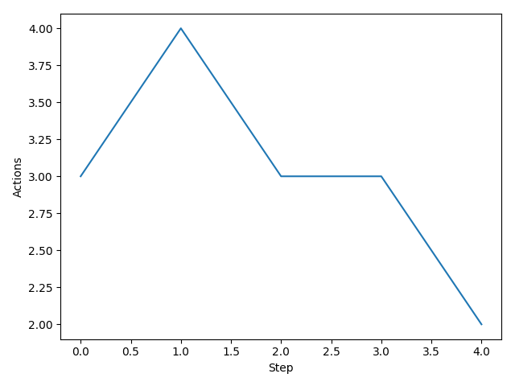

Then the stack from the current state being fed into the network again to choose the first
action of the next set of steps:

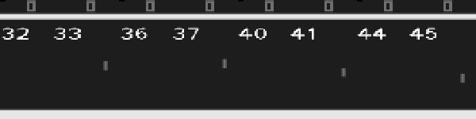

And so on.

## Design notes

The initial design ran each worker on a separate process, with replication of shared parameters done
using Distributed TensorFlow. I hoped that, avoiding global interpreter lock, this would be the
fastest way to do it, but the replication seemed to have a large overhead - it actually turned out
to be faster to run the workers on threads, so that no replication is necessary, running only the
environments in separate processes. This was inspired by OpenAI Baselines'
[`SubprocVecEnv`](https://github.com/openai/baselines/blob/36ee5d17071424f30071bcdc72ff11b18c577529/baselines/common/vec_env/subproc_vec_env.py).
  
## Training throughput benchmarks

How does OCD A3C's training throughput (environment steps/second) compare to a reference
implementation?

On a 16-core machine (an EC2 c5.4xlarge), running 16 workers:

* A2C from OpenAI Baselines achieves ~1000 steps per second
* OCD A3C achieves ~500 steps per second

The reduced through compared to A2C is presumably due to some combination of:
* The need for each worker to synchronise its own copy of the network with the global network on
  every update.
* Gradients being computed for each worker's batch of experience separately, rather than being able
  to compute gradients on one large batch combining the experience from all workers at once, as in
  A2C.
* GIL-induced thread juggling, since each worker runs on a separate thread.
  
## Lessons learned

### Data organisation

Thorough archival of test runs is absolutely vital for debugging. (I talk a bit more about this in
the context of a a different paper at
[Lessons Learned Reproducing a Deep Reinforcement Learning Paper](http://amid.fish/reproducing-deep-rl).)

Using a managed service like FloydHub is nice if you can afford it, but for this implementation I
was mainly using my university's cluster. The DIY solution I converged on by the end of this project
was the following:

* Store runs in a separate repository (so that when you're copying the code to a new machine you
  don't also have to copy all the runs), under Git LFS.
  (Example: [tensorflow-a3c-runs](https://github.com/mrahtz/tensorflow-a3c-runs/settings)
* Maintain a separate branch in that repository for each revision in the main code repository
  you do runs from, labelled by branch.
* Have your code automatically label each run with the current revision, just in case
  you mess up the branches
  (see e.g. [params.py](https://github.com/mrahtz/tensorflow-a3c/blob/3c839d6039cf9b4c18b726e2d552313e9be723d2/params.py#L87).
* Save the arguments used for each run - both those specified on the command line, and the full
  e.g. `argparse` namespace so you record default arguments too
  (also [params.py](https://github.com/mrahtz/tensorflow-a3c/blob/3c839d6039cf9b4c18b726e2d552313e9be723d2/params.py#L95)).


### Preprocessing

Preprocessing of Atari environment frames was by far the hardest thing to get right in this
implementation. Over the course of the project I ended up reimplementing preprocessing two times
before it was in a form I was confident was correct and was easily testable.

The final solution is heavily inspired by OpenAI Baselines'
[`atari_wrappers`](https://github.com/openai/baselines/blob/8c2aea2addc9f3ba36d4a0c937e6a2d09830afc7/baselines/common/atari_wrappers.py).
Taking a layered approach to preprocessing, with each stage of preprocessing being done using a
separate wrapper, makes both implementation and testing a lot easier.

If you're reproducing papers to learn about deep RL, I strongly recommend just using
`atari_wrappers`. Implementing the preprocessing from scratch did give me a much stronger
appreciation for the benefits of layered design, and it seems important to know about the tricks
that are used (episode reset on end-of-life and no-ops at the start of each episode came as
particular surprises to me), but it takes away so much time that could be spend learning about
actual RL stuff instead.

### Monte Carlo vs. Temporal Difference Updates

At the start, I was thinking that Monte Carlo updates would be simpler to get working than the
5-step temporal difference updates suggested by the paper - the bias introduced by the value
bootstrap seemed like it might complicate things. But during initial testing on Pong, though MC
updates did work when using heavy preprocessing (removing the frame and background, and setting the
ball and paddles to pure white), MC updates didn't work at all when using the generic Atari
preprocessing (just resizing and grayscaling the frame).

The ostensible explanation is that MC updates are much higher variance and therefore take longer to
converge. Maybe training was just too slow to show significant progress on the length of the runs I
was doing (~ 12 hours). But I'm hesitant to accept this as the full explanation, since MC updates
worked fine with the heavier preprocessing, and without taking too much longer.

Another possible explanation is the differences in gradient computation between MC and TD.  The
pseudocode in the paper suggests simply summing gradients over each step. With MC updates, because
you're summing gradients over the many steps of an entire episode, you'll end up taking a really
large step in parameter space on every update. Updates that large just seem like a bad idea.  You
could limit the size of the updates by e.g. dividing by the number of steps per episode, but then
you're going to be learning much more slowly than with TD updates, where you're also making only
small updates but you're making them much more regularly.

It's still surprising that large MC updates work at all with the heavier preprocessing, though.
Maybe it's something to do with the sparsity of the observations, zeroing out everything but the
ball and paddles. But I never did completely figure this out.

In summary: even though MC updates might seem conceptually simpler, in practice MC updates can work
a lot worse than TD updates; and in addition to the standard bias/variance tradeoff explanation, I
suspect it might be partly that with MC updates, you're taking large steps infrequently, whereas
with TD updates, you're taking small steps more frequently.

### Gradient Clipping 

One explanation for why running multiple workers in parallel works well is that it decorrelates
updates, since each worker contributes different experience at any given moment.

(Note that Figure 3 in the paper suggests this explanation might apply less to A3C than the paper's
other algorithms. For A3C the main advantage may just be the increased rate of experience
accumulation. But let's stick with the standard story for now and see where it goes.)

Even if there's diversity between each update, though, this says nothing about the diversity of
experience /within/ each update (where each update consists of a batch of 5 steps in the environment
from one worker). My impression from inspecting gradients and RMSprop statistics here and there is
that this can cause problems: if each update is too homogenous, each update can point in one
direction kind of sharply, leading to large gradients on each update. Gradient clipping therefore
seems to be pretty important for A3C.

(I didn't experiment with this super thoroughly, though. Looking back through my notes, gradient
norms and certain RMSprop statistics were definitely different with and without gradient clipping,
sometimes up to a factor of 10 or so. And I do have notes of some runs failing apparently because of
lack of gradient clipping. Nonetheless, take the above story with a grain of salt.)

(Also note that this is in contrast to A*2*C, where *each update* consists of experience from all
workers and is therefore more diverse.)

Sadly, amount of gradient clipping is one hyperparameter the paper doesn't list (and in fact,
learning rate and gradient clipping were tuned for each game individually). The value we use
(`max_grad_norm` in [`params.py`](params.py)) of 5.0 was determined through coarse line search over
all five games.

My main takeaways from these experiences are:
* If you're calculating gradients on batches with correlated data, gradient clipping probably /is/
  something you're going to have to worry about.
* If you're writing paper about an algorithm which uses gradient clipping, *please* quote what clip
  value you use.


## Reproducing papers efficiently

Overall, this project took about 150 hours. That's much longer than I expected it to take.

I think the main mistake I made was starting from a minimal set of features and gradually adding the
bells and whistles rather than starting from a known-good implementation then ablating to figure out
what was actually important. Some of the extras do end up just being small performance improvements,
but sometimes they're the difference between it working fine and not working at all, and it can be
really hard to guess in advance which any particular feature will be. (I'm thinking in particular
about a) gradient clipping and b) the difference between MC updates and TD updates.  To my
unexperienced self at the start of the project, both of these seemed like completely reasonable
simplifications. But figuring out that these two were key took so, so much time - there were always
other bugs which were easier to find and initially seemed important but once fixed turned out to be
non-critical red herrings.)

Advice I've since heard for how to approach these reproductions more efficiently instead suggests a
process more like:

1. Start with an existing implementation from a trusted source.
2. Scrutinize the code and experiment with small parts of it until you're confident you understand
   what every single line does. Make notes about the parts you're suspicious about the purpose of.
3. Rewrite the same implementation basically verbatim from memory. Test, and if it fails, compare to
   the original implementation. Iterate until it works.
4. Start again from scratch, writing an implementation in your own style. Once it works, ablate the
   parts you were suspicious of.
   
## Other Implementations

A nice thing about A3C is that there are lots of other implementations. Check out how other people
have implemented the same thing:

* OpenAI's [universe-starter-agent](https://github.com/openai/universe-starter-agent)
* Denny Britz's [implementation](https://github.com/dennybritz/reinforcement-learning/tree/master/PolicyGradient/a3c)
  in his [reinforcement-learning](https://github.com/dennybritz/reinforcement-learning) repo
* Yasuhiro Fujita's [async-rl](https://github.com/muupan/async-rl)
* Kosuke Miyoshi's [async_deep_reinforce](https://github.com/miyosuda/async_deep_reinforce)
* (Bonus 1: NVIDIA's [GA3C](https://github.com/NVlabs/GA3C), which uses a slightly different
  architecture but might be interesting nonetheless)
* (Bonus 2: OpenAI's [A2C implementation](https://github.com/openai/baselines/tree/master/baselines/a2c))
